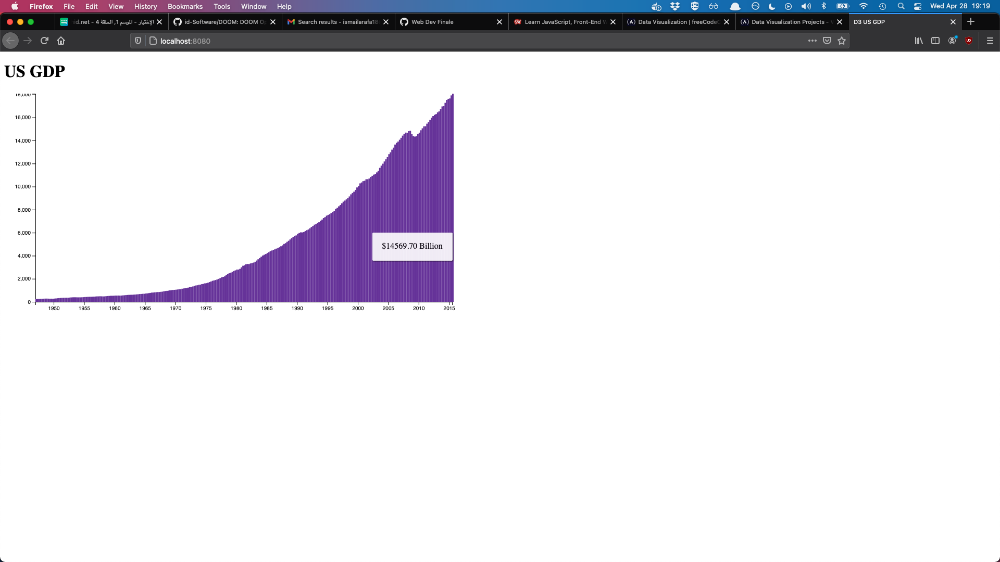

# d3-gdp-fcc
FreeCodeCamp project playing with D3 to render bar chart to represent US GDP over time

## How it works

The quickest way to start the app is to run `php -S localhost:8080`

### How it looks

